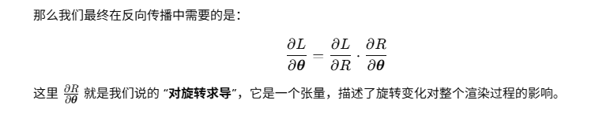

# 3D Gaussian Splatting for Real-Time Radiance Field Rendering

## Preliminaries

#### 快速光栅化

> https://blog.csdn.net/m0_63843473/article/details/136283934

#### SFM（Structure from Motion）

SFM 是一种计算机视觉技术，通过多张二维图像（拍摄同一场景但从不同角度）来恢复出相机运动轨迹和三维结构。它的核心任务有两个：

1. **相机姿态估计**（位姿、运动）
2. **三维点云重建**（三维几何结构）

## 3D Gaussian 简介

> https://huggingface.co/blog/zh/gaussian-splatting
>
> https://www.magnopus.com/blog/the-rise-of-3d-gaussian-splatting

3D 高斯点染技术由 [3D Gaussian Splatting for Real-Time Radiance Field Rendering](https://huggingface.co/papers/2308.04079) 一文首次提出。作为一种栅格化技术，3D 高斯点染可用于实时且逼真地渲染从一小组图像中学到的场景。本文将详细介绍其工作原理并讨论其对图形学的未来会带来什么影响。

### 什么是 3D 高斯点染？

3D 高斯点染本质上是一种栅格化技术。也就是说:

1. 我们有场景描述数据;
2. 我们会把这些数据在屏幕上渲染出来。

大家可能对计算机图形学中的三角形栅格化比较熟悉，其通过在屏幕上渲染许多三角形的方式来绘制图形。

其实 3D 高斯点染与三角形栅格化是一样的，只不过把基本绘图元素从三角形换成了高斯图像。下图给出了高斯图像的一个例子，为清晰起见，我们标出了它的边框。

每个高斯图像可由以下参数来描述:

- **位置**: 所在位置 (XYZ)
- **协方差**: 缩放程度 (3x3 矩阵)
- **颜色**: 颜色 (RGB)
- **Alpha**: 透明度 (α)

在实践中，我们通过在屏幕上绘制多个高斯图像，从而画出想要的图像。

上图是由 3 个高斯图像渲染出的图像。那么用 700 万个高斯图像可能会渲染出怎样的图像呢？看看下图:

如果这 700 万个高斯图像每个都完全不透明的话，渲染出的图像又会怎么样呢？如下:

在 3D Gaussian 中，不光使用了点，还使用了 splas，可以柔和地融合在一起。每一个 splat 都类似一个点，但它有自己的颜色和透明度。在传统的点云可视化方法中，就只是机械地显示了每一个点。但是使用论文中的方法，就能将各个部分互相融合，达到一种平滑的效果。这也就是我们不能简单地使用 CloudCompare 查看输出的原因。

为了做到这一点，作者使用了高斯数学公式。高斯函数是 3D 高斯溅射的基础，类似于钟形曲线，对于将单个点转换为生动、连续的场景至关重要。

以上，我们对 3D 高斯点染有了一个初步的认识。接下来，我们了解一下点染的具体过程。

### 点染过程

#### 1. 从运动中恢复出结构

第一步是使用运动恢复结构 (Structure from Motion，SfM) 方法从一组图像中估计出点云。SfM 方法可以让我们从一组 2D 图像中估计出 3D 点云。我们可以直接调用 [COLMAP](https://colmap.github.io/) 库来完成这一步。

#### 2. 用高斯图像对云中的每个点进行建模

接下来，把每个点建模成一个 3D 高斯图像。从 SfM 数据中，我们能推断出每个高斯图像的位置和颜色。这对于一般的栅格化已经够用了，但如果要产生更高质量的表征的话，我们还需要对每个高斯图像进行训练，以推断出更精细的位置和颜色，并推断出协方差和透明度。

#### 3. 训练

与神经网络类似，我们使用随机梯度下降法进行训练，但这里没有神经网络的层的概念 (都是 3D 高斯函数)。训练步骤如下:

1. 用当前所有可微高斯图像渲染出图像 (稍后详细介绍)
2. 根据渲染图像和真实图像之间的差异计算损失
3. 根据损失调整每个高斯图像的参数
4. 根据情况对当前相关高斯图像进行自动致密化及修剪

步骤 1-3 比较简单，下面我们稍微解释一下第 4 步的工作:

- 如果某高斯图像的梯度很大 (即它错得比较离谱)，则对其进行分割或克隆
  - 如果该高斯图像很小，则克隆它
  - 如果该高斯图像很大，则将其分割
- 如果该高斯图像的 alpha 太低，则将其删除

这么做能帮助高斯图像更好地拟合精细的细节，同时修剪掉不必要的高斯图像。

#### 4. 可微高斯栅格化

如前所述，3D 高斯点染是一种 *栅格化* 方法，即我们可以用其将数据渲染到屏幕上。作为众多栅格化方法的 *其中之一* ，它有两个特点:

1. 快
2. 可微

你可在 [此处](https://github.com/graphdeco-inria/diff-gaussian-rasterization) 找到可微高斯渲染器的原始实现。其主要步骤为:

1. 针对给定相机视角，把每个 3D 高斯图像投影到 2D。
2. 按深度对高斯图像进行排序。
3. 对每个像素，从前到后计算每个高斯函数在该像素点的值，并将所有值混合以得到最终像素值。

更多细节及优化可参阅 [论文](https://huggingface.co/papers/2308.04079)。

渲染器可微这一点很重要，因为这样我们就可以用随机梯度下降法来训练它。但这一点仅对训练阶段很重要，训后的高斯函数是可以用不可微的方式来表示的。

### 有啥用？

为什么 3D 高斯点染受到如此多的关注？最直接的原因是其非凡的实力。有了它，对高画质场景的实时渲染成为了可能。有了这个能力，我们可以解锁更多可能的应用。

比如说，可以用它来渲染动画吗？即将发表的论文 [Dynamic 3D Gaussians: tracking by Persistent Dynamic View Synthesis](https://arxiv.org/pdf/2308.09713) 似乎表明这有戏。还有更多其他问题有待研究。它能对反射进行建模吗？可以不经参考图像的训练就直接建模吗……

最后，当前人们对 [具身智能 (Embodied AI)](https://ieeexplore.ieee.org/iel7/7433297/9741092/09687596.pdf) 兴趣日隆。但作为人工智能的一个研究领域，当前最先进的具身智能的性能仍然比人类低好几个数量级，其中大部分的挑战在 3D 空间的表示上。鉴于 3D 高斯分布可以产生致密的 3D 空间表示，这对具身智能研究有何影响？

所有这些问题都引发了人们对 3D 高斯点染的广泛关注。时间会告诉我们答案！

### 图形学的未来

3D 高斯点染会左右图形学的未来吗？我们先来看下该方法的优缺点:

**优点**

1. 高品质、逼真的场景
2. 快速、实时的渲染
3. 更快的训练速度

**缺点**

1. 更高的显存使用率 (4GB 用于显示，12GB 用于训练)
2. 更大的磁盘占用 (每场景 1GB+)
3. 与现有渲染管线不兼容
4. 仅能绘制静态图像 (当前)

到目前为止，3D 高斯点染的 CUDA 原始实现尚未与 Vulkan、DirectX、WebGPU 等产品级渲染管道进行适配，因此尚不清楚其会对现有渲染管线带来什么影响。

已有的适配如下:

1. [远程显示器](https://huggingface.co/spaces/dylanebert/gaussian-viewer)
2. [WebGPU 显示器](https://github.com/cvlab-epfl/gaussian-splatting-web)
3. [WebGL 显示器](https://huggingface.co/spaces/cakewalk/splat)
4. [Unity 显示器](https://github.com/aras-p/UnityGaussianSplatting)
5. [优化过的 WebGL 显示器](https://gsplat.tech/)

这些显示器要么依赖于远程流式传输 (1)，要么依赖于传统的基于 2x2 像素块的栅格化方法 (2-5)。虽然基于 2x2 像素块的方法与数十年来的图形技术兼容，但它可能会导致质量/性能的降低。然而，[第 5 个显示器](https://gsplat.tech/) 的工作又表明，尽管采用基于 2x2 像素块的方法，通过巧妙的优化我们仍可以达到高的质量及性能。

那么有没有可能需要针对生产环境重实现 3D 高斯点染代码呢？答案是 *有可能* 。当前主要的性能瓶颈在对数百万个高斯图像进行排序上，在论文的原始实现中，这一过程是通过 [CUB 库的基数排序](https://nvlabs.github.io/cub/structcub_1_1_device_radix_sort.html) 原语来高效实现的，但该高性能原语仅在 CUDA 中可用。我们相信，经过努力，其他渲染管线也可以达到相仿的性能水平。

### 对比: 3D Gaussian Splatting vs. Photogrammetry vs NeRF

相同点：都需要从多个角度对一个物体摄影。

#### Photogrammetry

使用图像和相机位姿构建 3D mesh。

- 优点：
  - 计算开销相对较小，直接输出 3D mesh。输出的 3D mesh 可以轻松地用于游戏引擎管道渲染。
  - 此外，这些网格可以为动画添加皮肤，使其成为游戏开发和动画模拟应用的理想选择。
- 缺点：
  - 处理闪亮或透明的表面时限制很大，会在生成的 3D 模型上出现空洞和错误。

使用场景：计算资源有限，并且最终产品需要以 3D 网格模型的形式与标准游戏引擎或动画工具无缝集成时。

#### **Neural Radiance Fields (NeRF):**

使用人工智能和神经网络处理图像，生成场景的任何视角，通过混合现有照片的信息来填补任何空白或缺失的照片。

- 优点
  - 可以生成一个场景的任何角度。通过融合已有图片，可以填补空白或确实的图片。因此 NeRF适用于复杂场景（Photogrammetry 在复杂场景中效果不好）。
  - 不需要大量不同角度的照片。
- 缺点
  - 与两外两种方案相比，NeRF 对算力的需求很大，渲染较慢

使用场景：非常适合需要在视点生成方面具有高度灵活性的应用程序以及处理不完整数据具有挑战性的场景。

#### **3D Gaussian Splatting**

使用栅格化技术，从小样本的图像中实时渲染逼真的场景。该技术从初始的一系列图片中估计出一个点云，然后将每个点转换成高斯，通过四组参数（位置，协向量，颜色，透明度）描述。

- 优点
  - 与 NeRF 相比，3D Gaussian Splatting 速度快，可以实时栅格化，能做出高质量的逼真场景。
  - 特别擅长渲染头发等薄表面，提供高质量的可视化效果。
- 缺点
  - 需要大量显存，与现有的渲染管道不完全兼容。

## 3D Gaussian 应用

> https://www.sohu.com/a/745533126_121124366

- 将文本转化为3D 模型
  - 
- 让3D编辑像PS一样简单！Gaussian Editor：在几分钟内完成3D场景增删改
  - 
- 切分物体：几毫秒完成3D分割、千倍加速
  - 
- 三维视觉与感知
  - 用高斯分布建模点云中的物体，帮助感知算法更好地理解场景的结构和不确定性。在目标检测中表示目标位置的概率分布。
  - 自动驾驶，工业机器人视觉，安防监控。
- 3D点云压缩与建模
  - 用3D高斯代替原始点云，实现稀疏、高效的空间表示（每个高斯可代替多个点）。降低存储与传输成本。可用于高效地构建复杂设备或工厂的三维模型。
  - 激光雷达扫描（Lidar），三维扫描建模（3D scanning and reconstruction），数字工厂、数字孪生（Digital Twin）
- 实时渲染与虚拟现实
  - 基于3D Gaussian Splatting 的技术在实时渲染中非常高效，适用于需要交互式展示的工业可视化。利用高斯体的可微特性进行图像重建或渲染。
  - 工业设计评审（Virtual prototyping），VR/AR虚拟展示，数字博物馆、虚拟地产
- 医学图像处理
  - 将器官或组织建模为3D高斯分布，增强对形变、不确定性的建模能力。可用于概率性病变识别或手术路径规划。
  - MRI/CT三维重建，器官或肿瘤建模，手术导航系统
- 机器人路径规划与地图构建（SLAM）
  - 使用3D高斯构建环境地图，形成**概率地图**（probabilistic map），提升鲁棒性。在动态环境中更好地处理障碍物的概率建模。
  - 服务机器人，工业巡检机器人，无人机自主导航
- 三维重建与文化遗产保护
  - 使用稀疏3D高斯建模方式对实物进行轻量级建模，高质量重建物体外形和纹理。
  - 历史建筑三维建模，艺术品数字存档
- VR
- 互动游戏和仿真
  - 将 3D Gaussian 和游戏引擎 （e.g. Unity, Unreal Engine）结合。
  - For Unity, the GaussianSplatting package ([Unity Asset Store](https://assetstore.unity.com/)) and for Unreal Engine, the UEGaussianSplatting plugin ([Unreal Engine Marketplace](https://www.unrealengine.com/marketplace/en-US/product/uegaussiansplatting-3d-gaussian-splatting-rendering-feature-for-ue)) are examples of such developments.
- 

## 旋转

> https://zhuanlan.zhihu.com/p/619646891

**对旋转求导，得到的是目标函数（loss）对旋转参数的梯度**。

更具体地说，3D Gaussian Splatting 中每个高斯点都有一个旋转参数 $${\theta}$$（比如用轴角向量表示的）。我们希望优化这些旋转参数，使得渲染图像与真实图像越接近越好。

假设：

对旋转求导后得到什么？得到的是损失函数对旋转参数的梯度（用于反向传播优化）

为什么要对旋转求导？因为旋转影响高斯形状和位置，进而影响渲染图像；为了让网络自动学习最优旋转，需要可导性来更新旋转参数

### Premininaries

#### 角速度

**角速度**（angular velocity）是描述**物体绕某一固定轴旋转的快慢和方向**的物理量。

- 角速度告诉我们一个物体**每秒转过多少角度**（通常用“弧度”表示）；

- 就像速度是“位置随时间的变化率”，角速度是“**角度随时间的变化率**”。

角速度通常用希腊字母 $$ω$$ 表示：
$$
\omega = \frac{d\theta}{dt}
$$

- ω：角速度（单位：rad/s，弧度/秒）；
- θ：角位移（可以是一个角度或轴角向量）；
- t：时间。

## 如何对旋转矩阵求导

旋转矩阵如何求导，参考: https://zhuanlan.zhihu.com/p/619646891

